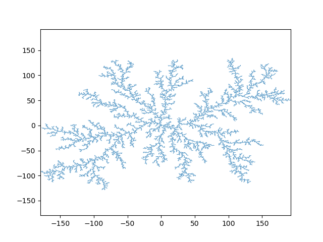

# Introduction
This is an implementation of the [Diffusion-limited aggregation](https://en.wikipedia.org/wiki/Diffusion-limited_aggregation) model as explained to me by Prof. Stefan Steinerberger in an University of Washington AMATH department seminar. I've been told that producing larger DLA structures is still computationally limited and has academic interest, so this is my attempt at a C++ implementation with performance in mind. This implementation produces 10,000 particle in 3 seconds single-threaded.

# Set up
This implementation uses the C++ `boost::geometry` library. It can be downloaded in Linux by the following:
```bash
wget https://boostorg.jfrog.io/artifactory/main/release/1.83.0/source/boost_1_83_0.tar.gz
tar xf boost_1_83_0.tar.gz 
mv boost_1_83_0/boost .
```
The code itself can be compiled simply by `g++ -O3 main.cpp -o run.exe`.

# Running
Executing `./run.exe` produces an file `output`, where each line is a space-separated 2D coordinate. A script `draw_output.py` can read the `output` file and draw it as a plot to `output.png`.

The output for 10,000 points:


